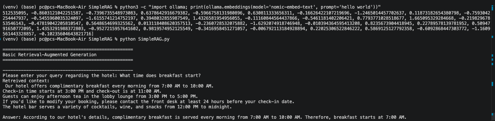
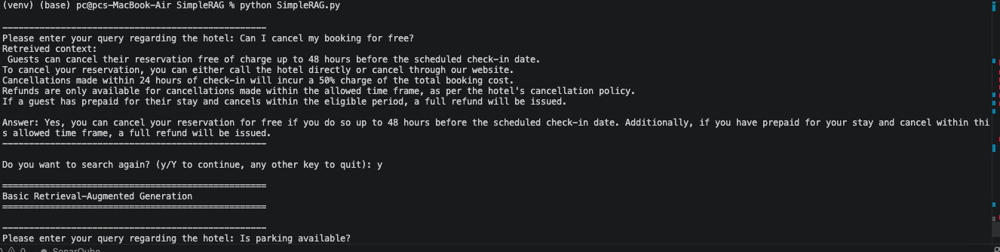

# Day 1 — RAG Architecture Study (StepByStep-RAG)

## Objective
Study, execute, and understand a reference open-source RAG pipeline:
https://github.com/gurucharanmk/StepByStep-RAG

## Environment Setup
- Repo cloned locally on MacBook Air (2015) via `git clone`
- Local machine cannot run Ollama (insufficient hardware for LLM inference)
- Workaround: Ollama server hosted on a Kaggle GPU notebook (Tesla T4),
  exposed publicly via an ngrok tunnel, with requests sent from local
  VS Code terminal using the `OLLAMA_HOST` environment variable
- Models used: `nomic-embed-text` (embeddings), `llama3.2` (generation)

## Module Executed
`SimpleRAG/SimpleRAG.py` — the core retrieval + generation loop

## Architecture / Data Flow
1. **Indexing**: 26 hardcoded sentences about a hotel (details, booking,
   cancellation, refund, dining, amenities policies) are embedded once
   at startup via `nomic-embed-text`, stored as an in-memory list of vectors
   (no external vector database used)
2. **Query embedding**: user's question is embedded the same way
3. **Retrieval**: cosine similarity between query vector and all document
   vectors; top-5 most similar sentences selected via `heapq.nlargest`
4. **Prompt construction**: retrieved sentences + system prompt (defines
   assistant persona/scope) + user question combined into one prompt
5. **Generation**: full prompt sent to `llama3.2` via `ollama.chat()`,
   grounded answer returned

## Sample Execution Output

**Retrieved context:**
**Generated answer:**
> According to our hotel's details, complimentary breakfast is served every
> morning from 7:00 AM to 10:00 AM. Therefore, breakfast starts at 7:00 AM.

### Query 1 — Breakfast Timing

### Query 2 — Cancellation Policy

## Observations, Limitations & Assumptions
- No real vector database (e.g. FAISS, Chroma) — brute-force cosine
  similarity over an in-memory Python list; fine for ~26 documents,
  would not scale to large corpora
- Retrieval always returns exactly top-5 documents regardless of
  relevance score — no minimum similarity threshold, so low-relevance
  results could still get passed to the LLM
- System prompt hardcodes hotel-domain assumptions (booking, cancellation,
  etc.) — not a general-purpose RAG system
- No chunking — each "document" is a single short hand-written sentence,
  not real-world long-form text (this is addressed later in the
  RAGStream module, which adds proper text chunking)

## Setup Challenges (Infra Debugging Log)
- MacBook Air 2015 hardware insufficient to run Ollama locally →
  hosted Ollama on Kaggle instead
- Kaggle base image missing `zstd`, blocking Ollama installer →
  resolved via `apt-get install zstd`
- Initial ngrok tunnel returned `403 Forbidden` — Ollama rejects
  requests with a non-localhost `Host` header (DNS-rebinding
  protection) even with `OLLAMA_ORIGINS=*` set → resolved using
  ngrok's `host_header="rewrite"` option
- Kaggle interactive sessions reset after ~1hr idle, wiping all
  installs outside `/kaggle/working` → required re-running full
  setup after breaks

## Files in this folder
- `kaggle-setup/` — downloaded Kaggle notebook (Ollama + ngrok setup)
- `screenshots/` — query/response evidence from SimpleRAG.py

## Reference
Original repository: https://github.com/gurucharanmk/StepByStep-RAG